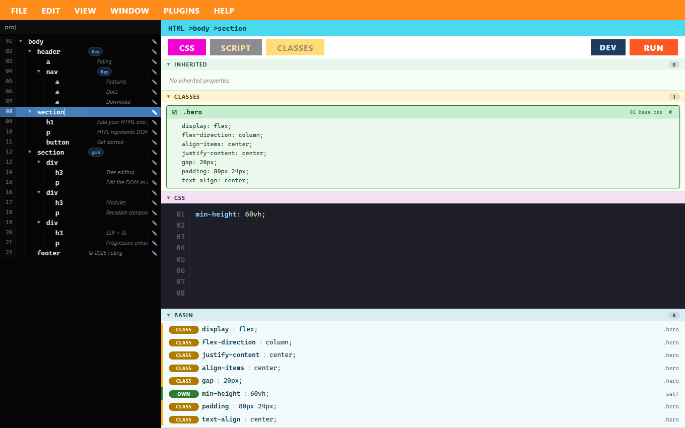

# Foling

HTFL (HyperText Foldering Language) 用のデスクトップエディター。
HTML の DOM 構造を **フォルダ階層** で表現し、ツリー編集・CSS/本文編集・HTML 出力を行えます。

> ライセンス: **AGPL-3.0-or-later** ｜ 技術: **Tauri 2 · React · TypeScript · Rust**



## 主な機能

- **フォルダ = 要素** の DOM ツリーエディタ(追加・並べ替え・コピー&ペースト)
- 要素ごとの **CSS / 本文 / 属性 / クラス / リンク** 編集(自動保存)
- プロジェクト **変数**(`$colorMain` など)と **CSS リセット**
- **HTML エクスポート**(HTFL → 1 枚の .html)/ **インポート**(.html → HTFL)
- **dev モード**: プレビューで要素をクリックすると対応する設定へジャンプ
- **プラグイン**: エクスポータ(任意形式へ変換)・クラス辞書・スニペット
- **検索**(Ctrl+Shift+F)、**Undo/Redo**、**ショートカット一覧**(HELP メニュー)

## ドキュメント

- [HTFL 言語仕様](docs/HTFL-SPEC.md) — フォルダ命名・`config.yaml` / `htfl.yaml` スキーマ・変数・ビルド
- [プラグイン開発ガイド](docs/PLUGINS.md) — マニフェスト・エクスポータ API・`doc` 型
- [MCP サーバーガイド](docs/MCP.md) — AI エージェント連携・ツール一覧・接続方法
- [変更履歴](CHANGELOG.md) ｜ [コントリビューション](CONTRIBUTING.md)

## HTFL とは

ファイルシステムのフォルダ構造で HTML の DOM を表現する言語です。

- フォルダ = HTML タグ
- フォルダ内の `config.yaml` = タグの属性 / クラス / id / CSS / リンク / 本文テキスト
- プロジェクトルートの `htfl.yaml` = プロジェクト共通変数 (`$colorMain` など)

### フォルダ命名規則 (ハイブリッド)

- `head`, `body` のように単純なタグ名
- 順序を制御したい場合は `01_div`, `02_section` のように `数値_タグ名` (アンダースコア区切り)
- 数値プレフィックス → 自動でソートに利用 (なければ末尾)

### `config.yaml` の例

```yaml
tag: div                # フォルダ名から自動推定。明示的に上書きしたい時のみ
id: hero
classes:
  - container
  - flex-row
attributes:
  data-key: value
content: |
  本文テキスト
css: |
  padding: 1rem 2rem;
  background-color: $colorMain;
links:
  - rel: stylesheet
    href: /styles/main.css
```

`$colorMain` のような変数は、プロジェクトルート直下の `htfl.yaml` で定義します。

```yaml
variables:
  colorMain: "#39b54a"
  colorFontSub: "#666"
  shadow: "0 2px 8px rgba(0,0,0,0.15)"
```

## 開発

### 必要環境

- Node.js 18+
- Rust (最新の stable)
- Tauri 2 のシステム依存関係 (Windows: Microsoft Edge WebView2 Runtime)

### セットアップ

```bash
npm install
```

### 開発実行

```bash
npm run tauri dev
```

初回は Rust の依存解決とビルドに数分かかります。

### サンプルプロジェクト

`sample-project/` 配下に動作確認用のサンプルがあります。
アプリ起動後、「プロジェクトフォルダを選択」から `sample-project/` を選んでください。

## アーキテクチャ

- フロントエンド: React + TypeScript + Vite
- バックエンド: Rust + Tauri 2 + serde_yml + walkdir
- DOM ツリーは `src-tauri/src/lib.rs` の `read_tree` で再帰的にスキャン
- `RUN` ボタンで `build_html` コマンドが走り、変数置換後の HTML をプレビューに渡す

## リリース / 配布

```bash
npm run tauri build
```

`src-tauri/target/release/bundle/` 配下に各 OS のインストーラが生成されます。

> **注意: 現在の配布物はコード署名されていません。**
> Windows では SmartScreen、macOS では Gatekeeper が「開発元不明」の警告を表示します。
> 正式配布の際は、Windows コード署名証明書 / Apple Developer ID による署名・公証(notarization)を
> 設定してください(`tauri.conf.json` の `bundle` セクション)。

## ライセンス

[GNU Affero General Public License v3.0 or later](LICENSE) (AGPL-3.0-or-later) で配布されます。
ネットワーク越しに（Web 版などで）改変版を提供する場合は、その利用者にソースコードを提供する義務があります（AGPL §13）。

Copyright (C) 2026 大松雄斗

このプログラムはフリーソフトウェアです。フリーソフトウェア財団が発行する GNU アフェロ一般公衆利用許諾書
(バージョン 3、またはそれ以降のバージョン)の条件の下で、再配布および改変ができます。
詳細は [`LICENSE`](LICENSE) を参照してください。

同梱する第三者コンポーネント（Rust クレート・npm パッケージ）のライセンスと著作権表示は
[`THIRD-PARTY-NOTICES.md`](THIRD-PARTY-NOTICES.md) を参照してください。
各ソースファイル先頭には SPDX 識別子 (`SPDX-License-Identifier: AGPL-3.0-or-later`) を付与しています。
